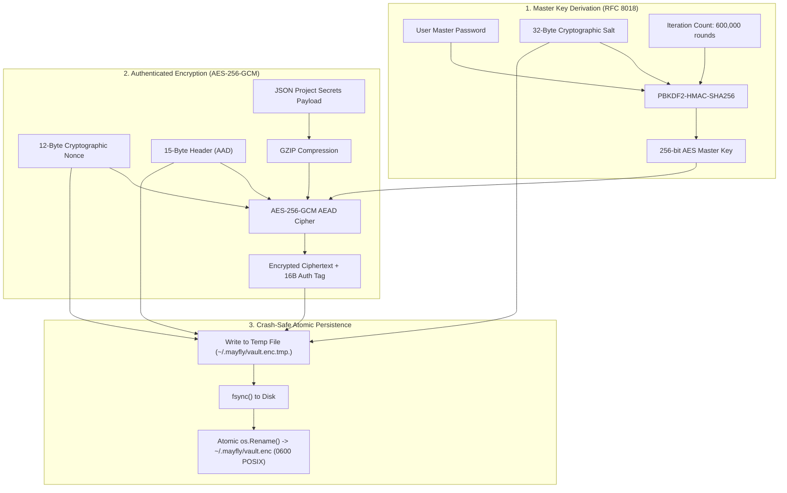

## Cryptographic Primitives

MayFly enforces authenticated, tamper-resistant encryption at rest using standard, audited cryptographic algorithms implemented exclusively through the Go standard library (`crypto/aes`, `crypto/cipher`, `crypto/sha256`, `crypto/hmac`, `crypto/rand`).



---

## Key Derivation (RFC 8018 PBKDF2)

Master passwords are never stored. Instead, an encryption key is derived using **PBKDF2-HMAC-SHA256**:

```
EncryptionKey = PBKDF2(
  Password = MasterPassword,
  Salt = CryptographicallyRandomSalt (32 bytes),
  Iterations = 600,000,
  KeyLength = 32 bytes (256 bits),
  Digest = SHA-256
)
```

### Parameters
- **Salt Length**: 32 bytes generated via `crypto/rand.Read`.
- **Iteration Count**: Default `600,000` rounds (aligned with OWASP recommendations for PBKDF2-HMAC-SHA256 to resist GPU cracking rigs).
- **Key Output Size**: 32 bytes (AES-256).

---

## Authenticated Encryption (AES-256-GCM)

Secrets are encrypted using **AES-256 in Galois/Counter Mode (GCM)**, providing both confidentiality and integrity authentication.

### Nonce Generation
- A fresh, cryptographically secure 12-byte (96-bit) nonce is generated via `crypto/rand` for **every write operation**.
- Nonce reuse is strictly prohibited and mathematically prevented.

### Associated Data (AEAD)
The 15-byte container header is passed as Authenticated Additional Data (AAD) into the GCM cipher. Any tampering with container version bytes, iteration counts, or salt lengths will cause authentication tag verification to fail during decryption before any ciphertext is parsed.

---

## Vault File Binary Layout

The vault is stored at `~/.mayfly/vault.enc` with strict POSIX permissions (`0600`).

```
+-------------------------------------------------------------------+
| Magic (6B) | Ver (1B) | KDF (1B) | Iter (4B) | SaltLen (1B)       | -> Header (15B AAD)
+-------------------------------------------------------------------+
| Salt (32B) | Nonce (12B) | GCM Ciphertext + Tag (16B)             | -> Body
+-------------------------------------------------------------------+
```

### Field Definitions
- **Magic Bytes (`0x00 - 0x05`)**: `MFVAUL` (0x4D 0x46 0x56 0x41 0x55 0x4C)
- **Format Version (`0x06`)**: `0x01`
- **KDF Identifier (`0x07`)**: `0x01` (PBKDF2-HMAC-SHA256)
- **Iteration Count (`0x08 - 0x0B`)**: 32-bit Big-Endian integer (default: `0x000927C0` = 600,000)
- **Salt Length (`0x0C`)**: Length of KDF salt (default: `0x20` = 32 bytes)
- **Salt (`0x0D - 0x2C`)**: 32 bytes of random salt.
- **Nonce (`0x2D - 0x38`)**: 12 bytes of fresh AES-GCM nonce.
- **Payload (`0x39+`)**: Compressed GZIP payload encrypted via AES-256-GCM with 16-byte Poly1305/GCM authentication tag.

---

## Memory Zeroization & Safety Guarantees

When secrets are loaded into memory:
1. **Volatile RAM Only**: Decrypted secrets reside solely in byte slices allocated in user-space RAM.
2. **Buffer Overwriting**: When a process finishes or when the vault auto-locks, memory buffers are explicitly wiped with zero bytes.
3. **`runtime.KeepAlive()` Protection**: Go's compiler optimizes away writes to memory buffers if it determines the variable is not read again. MayFly wraps memory clearing with `runtime.KeepAlive` to prevent compiler dead-store elimination.
4. **Echo Suppression**: Master password input uses low-level `termios` ioctl calls (`TCSETS` with `ECHO` disabled), ensuring master passwords never appear on stdout or terminal scrollback buffers.

---

## Atomic Write Guarantee

To prevent corruption during concurrent operations or sudden system restarts, all vault modifications execute via atomic file replacement:

1. A temporary file `~/.mayfly/vault.enc.tmp.<pid>` is opened with `0600` permissions.
2. The encrypted header, salt, nonce, and ciphertext are written.
3. `file.Sync()` flushes file buffers to underlying physical storage.
4. An atomic rename (`os.Rename`) overwrites `~/.mayfly/vault.enc`.

---

## Next Steps

- [In-Memory Injection Architecture](/docs/architecture/in-memory-injection): How environment tables are populated in RAM.
- [Cryptographic Audit Chain](/docs/architecture/audit-chain): SHA-256 Merkle-like logging mechanics.
- [Zero-Dependency Audit](/docs/reference/zero-dependency-audit): 13-point standard library substitution audit.


