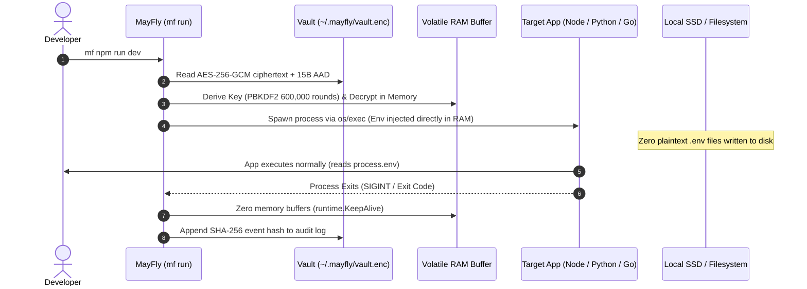

## 1. Zero-Disk Secrets Lifecycle

The fundamental promise of MayFly is that **decrypted plaintext secrets never touch physical storage media**.



```text
┌─────────────────────────┐
│ ~/.mayfly/vault.enc     │ <--- Encrypted at rest (AES-256-GCM + 600k PBKDF2 iterations)
└────────────┬────────────┘
             │ 1. Master password provided via low-level termios echo suppression
             ▼
┌─────────────────────────┐
│ MayFly Process RAM      │ <--- Decrypted strictly into volatile memory byte slices
└────────────┬────────────┘
             │ 2. Direct os/exec environment block injection
             ▼
┌─────────────────────────┐
│ Target Child Process    │ <--- Child reads process.env / os.Environ() directly
└────────────┬────────────┘
             │ 3. Child exits or receives SIGINT
             ▼
┌─────────────────────────┐
│ Memory Pages Zeroed     │ <--- Buffers overwritten with zero-bytes (runtime.KeepAlive)
└─────────────────────────┘
```

Even if an attacker runs a disk-scanning script, inspects filesystem swap caches, or reads Git status after execution, no unencrypted credential files exist.

---

## 2. Inode Project Binding

Traditional tools often bind configurations to folder names (e.g. `my-app`). If you have two repositories with identical names in different directories (e.g. `/home/user/work/api` vs `/home/user/personal/api`), path collisions can cause accidental secret cross-contamination.

MayFly eliminates this by resolving the **filesystem device ID (`st_dev`) and inode number (`st_ino`)**:

- **Hardware Identifier**: Inode numbers are unique 64-bit hardware identifiers assigned by the physical filesystem driver.
- **Symlink & Rename Resilient**: Symlinks and directory renames preserve the same underlying physical inode.
- **Cross-Contamination Protection**: Secrets registered for Project A cannot be decrypted or mapped to Project B even if directories share the same name.

---

## 3. Direct Host Execution (`os/exec`)

Instead of passing shell strings through `/bin/sh -c`, MayFly uses the Go standard library `os/exec.CommandContext` primitive:

- **Argument Preservation**: Arguments are passed as an exact string array without shell re-tokenization or unwanted glob expansion.
- **History Protection**: Sensitive command arguments never appear in `~/.bash_history`, `~/.zsh_history`, or fish history.
- **Signal Forwarding**: Operating system signals like `SIGINT` (Ctrl+C), `SIGTERM`, and `SIGHUP` are passed directly to the child process without intermediate shell trapping.
- **PTY Transparency**: Terminal standard input, standard output, and standard error file descriptors are piped transparently to preserve full ANSI colors and interactive prompts.

---

## 4. Volatile Memory Safety & Auto-Lock

To protect secrets held in volatile workstation RAM against memory scanning:

- **Buffer Zeroing**: Decrypted password byte slices and credentials are systematically overwritten with zero-bytes upon locking or process exit.
- **Compiler Dead-Store Preservation**: Zeroing routines invoke `runtime.KeepAlive()` to guarantee that Go compiler optimizations cannot elide the memory-clearing loops.
- **Idle Auto-Lock Timer**: When running in interactive TUI mode, an internal inactivity timer automatically locks the vault and zeroes all decrypted state after 15 minutes of idle time.

---

## 5. Tamper-Evident Hash Chain

Every operation (vault initialization, key updates, secret injections, leak scans) creates an immutable audit entry linked by SHA-256 hashes:

```text
Hash[N] = SHA256(Hash[N-1] + ":" + Timestamp + ":" + Action + ":" + Data)
```

If any entry in `~/.mayfly/audit.log` is modified, deleted, or truncated, `mf audit verify` will detect the broken cryptographic link immediately.

